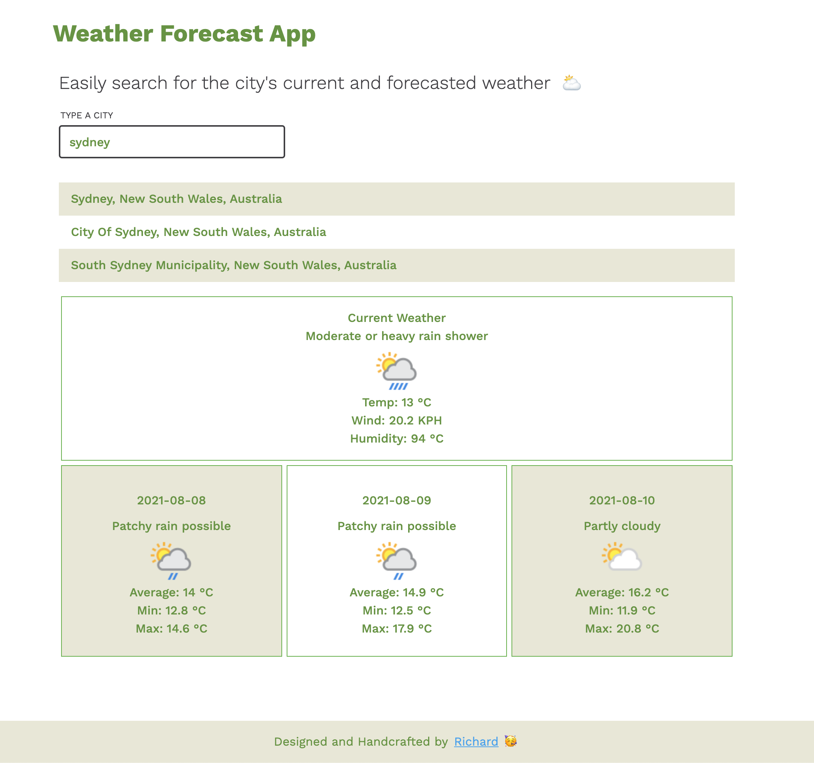
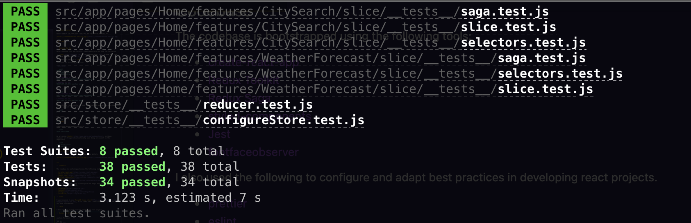

# Weather Forecast App

Easily search for the city's current and forecasted weather 🌤️

[https://chardmd-weather.netlify.app/](https://chardmd-weather.netlify.app/)



---

## Running the App

Before running this app locally, please make sure you have the following:

⚠️ [Yarn](https://yarnpkg.com) is recommended over `npm`. Please make sure you have at least `>=1.22.10`

⚠️ Latest LTS version of [Node.js](https://nodejs.org/en/) `>=14.0.0`

⚠️ Create the following env files:

`.env.local`

```shell
BROWSER=none
EXTEND_ESLINT=true
FAST_REFRESH=true

# base weather API
REACT_APP_WEATHER_API=https://api.weatherapi.com

# weather API key
REACT_APP_API_KEY=<api key here>
```

`.env.production`

```shell
GENERATE_SOURCEMAP=false

# base weather API
REACT_APP_WEATHER_API=https://api.weatherapi.com

# weather API key
REACT_APP_API_KEY=<api key here>
```

Once, all the requirements have been installed and created, You can simply run the project locally via:

```shell
yarn start
```

Run tests:

```shell
yarn test
```

Create and serve production build:

```shell
yarn start:prod
```

The project is using [Husky](https://www.npmjs.com/package/husky), so these commands are triggered automatically when doing pre-commit in the repository.

```shell
yarn eslint --fix
yarn prettify
```

## Live Version

See it in action, this app was deployed in Netlify.

[https://chardmd-weather.netlify.app/](https://chardmd-weather.netlify.app/)

---

## Codebase

The codebase is bootstrapped using the following tools:

- [create-react-app](https://create-react-app.dev)
- [Redux Toolkit](https://redux-toolkit.js.org/)
- [Redux Saga](https://redux-saga.js.org/)
- [styled-components](https://styled-components.com/)
- [Jest](https://jestjs.io/)
- [React Router](https://reactrouter.com)
- [fontfaceobserver](https://github.com/bramstein/fontfaceobserver)

I also used the following tools in configuring and setting up the best practices when developing react projects.

- [prettier](https://prettier.io/)
- [eslint](https://eslint.org/)
- [husky](https://www.npmjs.com/package/husky)
- [stylelint](https://stylelint.io/)

## Theme

I was inspired to use [MongoDB theme color](https://www.schemecolor.com/mongodb-logo-colors.php), as it looks cool. Please see the `styles` folder for more information.

## Tests

I have covered a good test coverage on this project, the testing covers the following:

- Integration testing for Redux Saga
- Selectors testing
- Slice/Reducer Testing
- Component/Snapshot testing



## Project Structure

This project is scable and production ready.

In this structure, pages can have multiple features, and each features have their components and reducers/selectors/saga.

Anyone can easily add new features on a page, as each features are independent to each other.

```
weather-forecast
|
├── src
│   └── app
│       ├── common => where shared components resides
│       ├── pages
|       │       ├── Home
|       |       |   |
|       |       |   ├──features
|       |       │   |   │
|       |       |   |   ├──CitySearch
|       |       │   │   │   ├── components
|       |       │   │   │   ├── slice =>
|       |       │   │   │   │   ├── index.js
|       |       │   │   │   │   ├── saga.js
|       |       │   │   │   │   ├── selectors.js
|       |       |   |   |   |   |── __tests__
|       |       │   │   │   ├── index.js
|       |       │   │   │   ├── Loadable.js.js
```

## Contributing

If you've got an improvement, just send in a pull request. If you've got feature ideas, simply [open a new issues](https://github.com/chardmd/weather-forecast/issues/new)!

## Author

Richard Dimalanta [https://chardmd.com](http://chardmd.com)

## License

Code released under the MIT License
